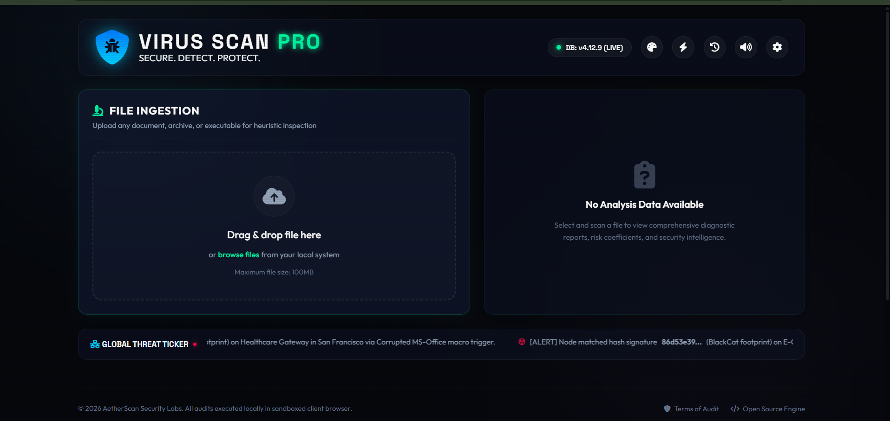
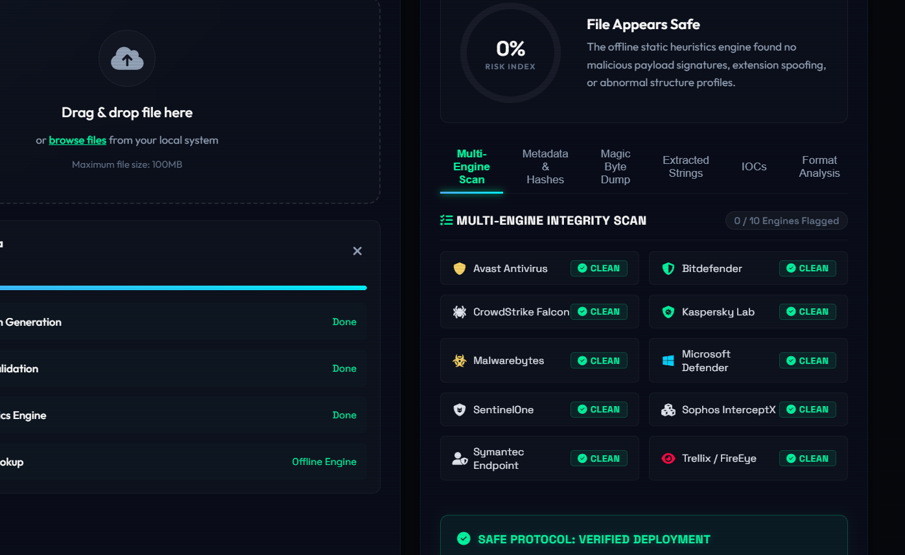

# 🛡️ Virus Scan Pro — Advanced Threat & File Analyzer

<p align="center">
  <strong>SECURE. DETECT. PROTECT.</strong>
</p>

> A futuristic, cyberpunk-styled **client-side malware analysis dashboard** that performs static heuristics, entropy analysis, IOC extraction, MITRE ATT&CK mapping, and optional VirusTotal reputation lookup — all from your browser.

---

## ✨ Features

| Feature | Description |
|---|---|
| 🔬 **Static Heuristics Engine** | Detects suspicious API calls, high-risk extensions, and obfuscation patterns |
| 🧬 **Entropy Analysis** | Calculates Shannon entropy to detect packed/encrypted payloads |
| 🔑 **File Hashing** | Generates MD5, SHA-1, and SHA-256 hashes via Web Workers |
| 🧲 **Magic Byte Validation** | Validates file signatures against known magic bytes (PE, PDF, ZIP, etc.) |
| 🌐 **IOC Extraction** | Extracts IPs, domains, URLs, crypto wallets, and suspicious strings |
| 🗺️ **MITRE ATT&CK Mapping** | Maps detected behaviors to MITRE tactics and techniques |
| 📦 **PE/APK Format Analysis** | Parses Windows executables and Android packages |
| 🔎 **VirusTotal Integration** | Optional API lookup for file reputation (bring your own key) |
| 📊 **Risk Score Gauge** | Visual animated risk assessment gauge |
| 📝 **Enterprise JSON Reports** | Download comprehensive analysis reports with AI analyst summary |
| 📜 **Scan History** | IndexedDB-powered persistent scan history |
| 🎵 **Audio Feedback** | Cyberpunk diagnostic chimes for scan results |
| 🎨 **Multi-Theme Support** | Emerald Matrix, Amber Hazard, Deep Ocean, and more |
| ⚡ **Performance Mode** | Toggle for low-end PCs (disables animations/effects) |
| 📁 **Multi-File Support** | Batch scan multiple files via drag & drop |
| 🖥️ **Mainframe Boot Screen** | Cinematic terminal-style intro animation |

---

## 🚀 Quick Start

### Prerequisites

- [Node.js](https://nodejs.org/) (v18 or higher recommended)
- npm (comes with Node.js)

### Installation

```bash
# 1. Clone the repository
git clone https://github.com/YOUR_USERNAME/virus-scan-pro.git

# 2. Navigate to the project folder
cd virus-scan-pro

# 3. Install dependencies
npm install

# 4. Start the development server
npm run dev
```

The app will open at `http://localhost:5173` in your browser.

---

## 📁 Project Structure

```
virus-scan-pro/
├── index.html              # Main HTML entry point
├── styles.css              # Full CSS with themes & animations
├── app.js                  # Core application engine (ES Module)
├── package.json            # Project config & dependencies
│
├── scanner/
│   └── worker.js           # Web Worker for hashing & entropy (chunked processing)
│
├── analyzers/
│   └── ioc.js              # IOC extraction engine (IPs, domains, crypto, etc.)
│
├── intelligence/
│   └── mitre.js            # MITRE ATT&CK tactic/technique mapping
│
├── reports/
│   └── export.js           # JSON/CSV report generators + AI analyst summary
│
├── ui/
│   └── history.js          # IndexedDB scan history module
│
├── .gitignore
├── LICENSE
└── README.md
```

---

## 🖼️ Screenshots

### Main Dashboard


### Scan Results


---

## 🔧 Configuration

### VirusTotal API Key (Optional)

1. Click the ⚙️ **Settings** gear icon in the app header
2. Enter your [VirusTotal API Key](https://www.virustotal.com/gui/my-apikey)
3. Click **Save** — the key is stored locally in your browser

### Performance Mode

Click the ⚡ button in the header to toggle Performance Mode, which disables:
- CSS animations & glow effects
- Grid overlay
- Background particles

Recommended for devices with **4GB RAM or less**.

---

## 🛠️ Tech Stack

- **Frontend:** Vanilla HTML5, CSS3, JavaScript (ES Modules)
- **Build Tool:** [Vite](https://vitejs.dev/)
- **Icons:** [Font Awesome 6](https://fontawesome.com/)
- **Fonts:** [Google Fonts](https://fonts.google.com/) (Outfit, Space Grotesk)
- **Storage:** IndexedDB (local scan history)
- **Processing:** Web Workers (non-blocking file analysis)

---

## 📄 License

This project is licensed under the **MIT License** — see the [LICENSE](LICENSE) file for details.

---

## 🤝 Contributing

Contributions are welcome! Feel free to:

1. Fork the repo
2. Create a feature branch (`git checkout -b feature/amazing-feature`)
3. Commit your changes (`git commit -m 'Add amazing feature'`)
4. Push to the branch (`git push origin feature/amazing-feature`)
5. Open a Pull Request

---

## ⚠️ Disclaimer

This tool is for **educational and research purposes only**. It performs **client-side static analysis** and does **not** execute or sandbox any files. It is not a replacement for a professional antivirus solution.

---

<p align="center">
  Made with 💙 by <strong>Vansh Yadav</strong>
</p>
